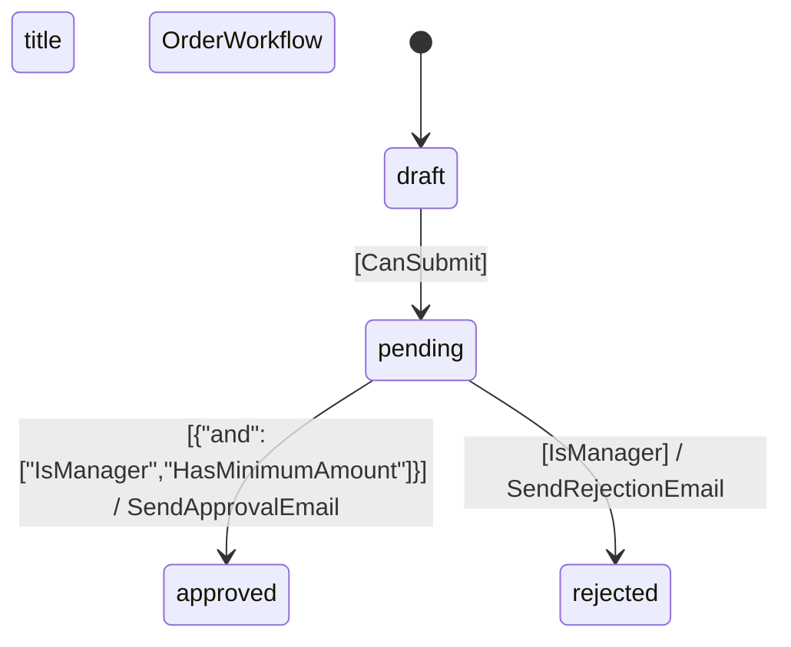

# Nouvelles Commandes Console Laravel Statecraft

Ce document décrit les nouvelles commandes console disponibles dans Laravel Statecraft, similaires à celles de Laravel Arc et Flowpipe.

## Commandes Disponibles

### 1. `statecraft:list` - Lister les définitions YAML

Liste toutes les définitions de machines d'état YAML dans le répertoire configuré.

```bash
# Liste toutes les définitions dans le répertoire par défaut
php artisan statecraft:list

# Liste toutes les définitions dans un répertoire personnalisé
php artisan statecraft:list --path=/path/to/statemachines
```

**Sortie :**
```
+------------+---------------+------------------+--------+-------------+---------+-------+
| File       | Name          | Model            | States | Transitions | Initial | Field |
+------------+---------------+------------------+--------+-------------+---------+-------+
| order.yaml | OrderWorkflow | App\Models\Order | 4      | 3           | draft   | state |
+------------+---------------+------------------+--------+-------------+---------+-------+
```

### 2. `statecraft:show` - Afficher le contenu d'une définition

Affiche le contenu détaillé d'une définition YAML spécifique.

```bash
# Affiche le contenu analysé d'une définition
php artisan statecraft:show order

# Affiche le contenu brut YAML
php artisan statecraft:show order --raw

# Utilise un répertoire personnalisé
php artisan statecraft:show order --path=/path/to/statemachines
```

**Sortie :**
```
State Machine Definition: resources/statemachines/order.yaml

Basic Information:
  Name: OrderWorkflow
  Model: App\Models\Order
  Field: state
  Initial State: draft

States:
  - draft (initial)
  - pending
  - approved
  - rejected

Transitions:
  draft → pending [guard: CanSubmit]
  pending → approved [guard: {"and":["IsManager","HasMinimumAmount"]}] → SendApprovalEmail
  pending → rejected [guard: IsManager] → SendRejectionEmail

Statistics:
  States: 4
  Transitions: 3
  Guarded transitions: 3
  Transitions with actions: 2
```

### 3. `statecraft:export` - Exporter dans différents formats

Exporte une définition YAML dans différents formats (JSON, Mermaid, Markdown).

```bash
# Export vers JSON (console)
php artisan statecraft:export order json

# Export vers Mermaid (console)
php artisan statecraft:export order mermaid

# Export vers Markdown (console)
php artisan statecraft:export order md

# Export vers un fichier
php artisan statecraft:export order json --output=/path/to/output.json

# Utilise un répertoire personnalisé
php artisan statecraft:export order json --path=/path/to/statemachines
```

#### Formats Supportés

**JSON :**
```json
{
    "name": "OrderWorkflow",
    "model": "App\\Models\\Order",
    "field": "state",
    "initial": "draft",
    "states": ["draft", "pending", "approved", "rejected"],
    "transitions": [
        {
            "from": "draft",
            "to": "pending",
            "guard": "CanSubmit",
            "action": null
        }
    ],
    "metadata": {
        "exported_at": "2025-07-17T08:54:38.062550Z",
        "exported_by": "Laravel Statecraft",
        "version": "1.0.0"
    }
}
```

**Mermaid :**


**Markdown :**
- Informations de base
- Liste des états
- Tableau des transitions
- Statistiques
- Diagramme Mermaid intégré

### 4. `statecraft:validate` - Vérifier les définitions

Valide les définitions YAML pour détecter les erreurs de structure et de logique métier.

```bash
# Valide une définition spécifique
php artisan statecraft:validate order

# Valide toutes les définitions
php artisan statecraft:validate --all

# Utilise un répertoire personnalisé
php artisan statecraft:validate order --path=/path/to/statemachines
```

**Sortie :**
```
Validating: order.yaml

✓ order.yaml is valid
```

ou

```
✗ order.yaml has validation errors:
  - Model class 'App\Models\Order' does not exist
  - State 'invalid_state' is not reachable from initial state
```

#### Types de Validation

1. **Validation de Structure :**
   - Présence des champs requis (name, model, states, initial)
   - Format des données

2. **Validation de Logique Métier :**
   - L'état initial existe dans la liste des états
   - Les transitions référencent des états valides
   - Détection d'états non accessibles

3. **Validation de Références :**
   - Existence des classes de modèles
   - Format des noms de classes de guards et actions

## Configuration

Les commandes utilisent la configuration suivante dans `config/statecraft.php` :

```php
return [
    // Chemin par défaut pour les définitions YAML
    'definitions_path' => resource_path('statemachines'),
    
    // Chemin par défaut pour le code généré
    'generated_code_path' => app_path('StateMachines'),
];
```

## Exemples d'Utilisation

### Workflow Typique

1. **Lister les définitions disponibles :**
   ```bash
   php artisan statecraft:list
   ```

2. **Examiner une définition spécifique :**
   ```bash
   php artisan statecraft:show order
   ```

3. **Valider toutes les définitions :**
   ```bash
   php artisan statecraft:validate --all
   ```

4. **Exporter pour documentation :**
   ```bash
   php artisan statecraft:export order md --output=docs/order-workflow.md
   ```

### Intégration CI/CD

```bash
# Dans votre pipeline CI/CD
php artisan statecraft:validate --all
```

### Génération de Documentation

```bash
# Exporter tous les workflows en Markdown
for file in resources/statemachines/*.yaml; do
    name=$(basename "$file" .yaml)
    php artisan statecraft:export "$name" md --output="docs/$name-workflow.md"
done
```

## Fonctionnalités Avancées

### Support des Guard Expressions

Les commandes supportent complètement les nouvelles expressions de guards :

```yaml
transitions:
  - from: pending
    to: approved
    guard:
      and:
        - IsManager
        - HasMinimumAmount
```

### Gestion d'Erreurs Robuste

- Gestion gracieuse des fichiers manquants
- Messages d'erreur détaillés
- Validation complète des définitions

### Performance

- Traitement en lot pour la validation
- Mise en cache des définitions analysées
- Optimisation pour les gros volumes de fichiers

Ces commandes rendent Laravel Statecraft plus facile à utiliser et à maintenir, en fournissant des outils puissants pour la gestion des définitions de machines d'état.
