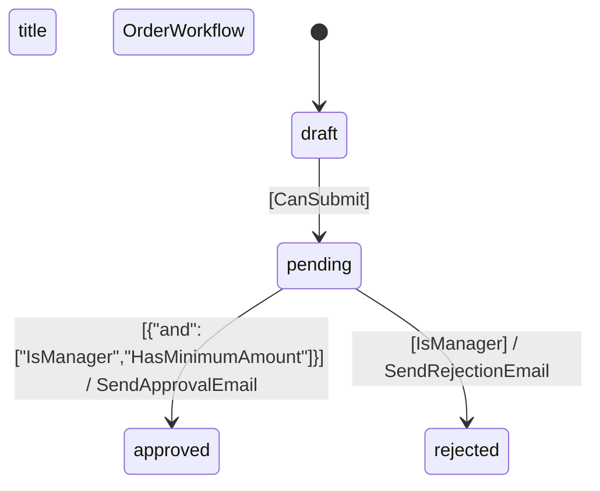

# Laravel Statecraft Console Commands

This document describes the powerful console commands available in Laravel Statecraft, providing comprehensive tools for managing state machine definitions.

## Available Commands

### 1. `statecraft:list` - List YAML Definitions

Lists all YAML state machine definitions in the configured directory.

```bash
# List all definitions in default directory
php artisan statecraft:list

# List all definitions in a custom directory
php artisan statecraft:list --path=/path/to/statemachines
```

**Output:**
```
+------------+---------------+------------------+--------+-------------+---------+-------+
| File       | Name          | Model            | States | Transitions | Initial | Field |
+------------+---------------+------------------+--------+-------------+---------+-------+
| order.yaml | OrderWorkflow | App\Models\Order | 4      | 3           | draft   | state |
+------------+---------------+------------------+--------+-------------+---------+-------+
```

### 2. `statecraft:show` - Show Definition Content

Shows detailed content of a specific YAML definition.

```bash
# Show parsed content of a definition
php artisan statecraft:show order

# Show raw YAML content
php artisan statecraft:show order --raw

# Use custom directory
php artisan statecraft:show order --path=/path/to/statemachines
```

**Output:**
```
State Machine Definition: resources/statemachines/order.yaml

Basic Information:
  Name: OrderWorkflow
  Model: App\Models\Order
  Field: state
  Initial State: draft

States:
  - draft (initial)
  - pending
  - approved
  - rejected

Transitions:
  draft → pending [guard: CanSubmit]
  pending → approved [guard: {"and":["IsManager","HasMinimumAmount"]}] → SendApprovalEmail
  pending → rejected [guard: IsManager] → SendRejectionEmail

Statistics:
  States: 4
  Transitions: 3
  Guarded transitions: 3
  Transitions with actions: 2
```

### 3. `statecraft:export` - Export to Different Formats

Exports a YAML definition to different formats (JSON, Mermaid, Markdown).

```bash
# Export to JSON (console)
php artisan statecraft:export order json

# Export to Mermaid (console)
php artisan statecraft:export order mermaid

# Export to Markdown (console)
php artisan statecraft:export order md

# Export to file
php artisan statecraft:export order json --output=/path/to/output.json

# Use custom directory
php artisan statecraft:export order json --path=/path/to/statemachines
```

#### Supported Formats

**JSON:**
```json
{
    "name": "OrderWorkflow",
    "model": "App\\Models\\Order",
    "field": "state",
    "initial": "draft",
    "states": ["draft", "pending", "approved", "rejected"],
    "transitions": [
        {
            "from": "draft",
            "to": "pending",
            "guard": "CanSubmit",
            "action": null
        }
    ],
    "metadata": {
        "exported_at": "2025-07-17T08:54:38.062550Z",
        "exported_by": "Laravel Statecraft",
        "version": "1.0.0"
    }
}
```

**Mermaid:**


**Markdown:**
- Basic information
- States list
- Transitions table
- Statistics
- Embedded Mermaid diagram

### 4. `statecraft:validate` - Validate Definitions

Validates YAML definitions to detect structural and business logic errors.

```bash
# Validate specific definition
php artisan statecraft:validate order

# Validate all definitions
php artisan statecraft:validate --all

# Use custom directory
php artisan statecraft:validate order --path=/path/to/statemachines
```

**Output:**
```
Validating: order.yaml

✓ order.yaml is valid
```

or

```
✗ order.yaml has validation errors:
  - Model class 'App\Models\Order' does not exist
  - State 'invalid_state' is not reachable from initial state
```

#### Validation Types

1. **Structure Validation:**
   - Required fields presence (name, model, states, initial)
   - Data format validation

2. **Business Logic Validation:**
   - Initial state exists in states list
   - Transitions reference valid states
   - Unreachable states detection

3. **Reference Validation:**
   - Model class existence
   - Guard and action class name format validation

### 5. `statecraft:make` - Generate YAML Definition

Creates a new YAML state machine definition file.

```bash
# Generate basic definition
php artisan statecraft:make order-workflow

# Generate with custom options
php artisan statecraft:make article-status --states=draft,review,published --initial=draft

# Generate with custom model
php artisan statecraft:make user-subscription --model=App\\Models\\User --states=trial,active,suspended
```

**Generated file structure:**
- Basic state machine configuration
- Model class path (auto-generated from name)
- Default states and transitions
- Commented guard and action examples

### 6. `statecraft:generate` - Generate PHP Classes

Generates PHP classes (guards, actions, model examples) from existing YAML definition.

```bash
# Generate classes from YAML
php artisan statecraft:generate database/state_machines/order-workflow.yaml

# Generate from custom path
php artisan statecraft:generate storage/state_machines/custom-workflow.yaml
```

**Generated classes:**
- **Guards**: `app/StateMachines/Guards/{GuardName}.php`
- **Actions**: `app/StateMachines/Actions/{ActionName}.php`
- **Model Example**: `app/StateMachines/{ModelName}Example.php`

## Configuration

The commands use the following configuration in `config/statecraft.php`:

```php
return [
    // Default path for YAML definitions
    'definitions_path' => resource_path('statemachines'),
    
    // Default path for generated code
    'generated_code_path' => app_path('StateMachines'),
];
```

## Usage Examples

### Typical Workflow

1. **List available definitions:**
   ```bash
   php artisan statecraft:list
   ```

2. **Examine specific definition:**
   ```bash
   php artisan statecraft:show order
   ```

3. **Validate all definitions:**
   ```bash
   php artisan statecraft:validate --all
   ```

4. **Export for documentation:**
   ```bash
   php artisan statecraft:export order md --output=docs/order-workflow.md
   ```

### CI/CD Integration

```bash
# In your CI/CD pipeline
php artisan statecraft:validate --all
```

### Documentation Generation

```bash
# Export all workflows to Markdown
for file in resources/statemachines/*.yaml; do
    name=$(basename "$file" .yaml)
    php artisan statecraft:export "$name" md --output="docs/$name-workflow.md"
done
```

## Advanced Features

### Guard Expression Support

The commands fully support the new guard expressions:

```yaml
transitions:
  - from: pending
    to: approved
    guard:
      and:
        - IsManager
        - HasMinimumAmount
```

### Robust Error Handling

- Graceful handling of missing files
- Detailed error messages
- Complete definition validation

### Performance

- Batch processing for validation
- Caching of parsed definitions
- Optimization for large file volumes

These commands make Laravel Statecraft easier to use and maintain by providing powerful tools for state machine definition management.
