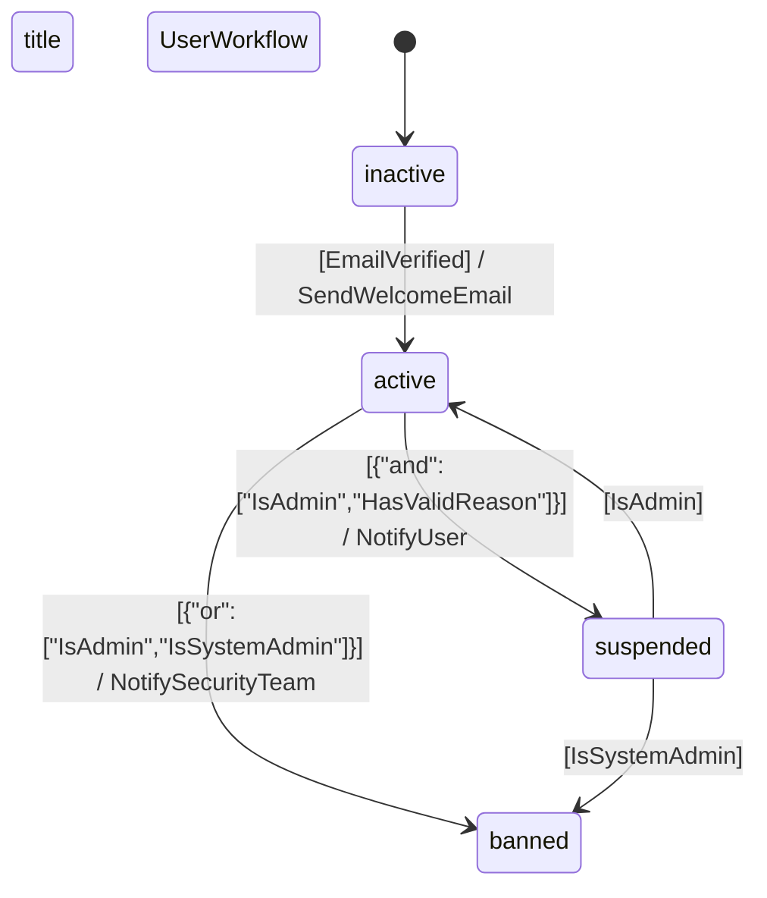

# UserWorkflow

## Basic Information

- **Name**: UserWorkflow
- **Model**: App\Models\User
- **Field**: state
- **Initial State**: inactive

## States

- `inactive` *(initial)*
- `active`
- `suspended`
- `banned`

## Transitions

| From | To | Guard | Action |
|------|----|----|--------|
| `inactive` | `active` | `EmailVerified` | `SendWelcomeEmail` |
| `active` | `suspended` | `{"and":["IsAdmin","HasValidReason"]}` | `NotifyUser` |
| `suspended` | `active` | `IsAdmin` |  |
| `active` | `banned` | `{"or":["IsAdmin","IsSystemAdmin"]}` | `NotifySecurityTeam` |
| `suspended` | `banned` | `IsSystemAdmin` |  |

## Statistics

- **States**: 4
- **Transitions**: 5
- **Guarded transitions**: 5
- **Transitions with actions**: 3

## State Diagram

---
*Generated by Laravel Statecraft on 2025-07-17 09:08:14*
